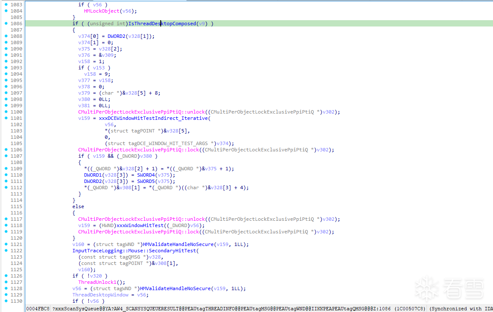
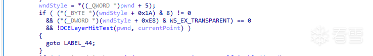
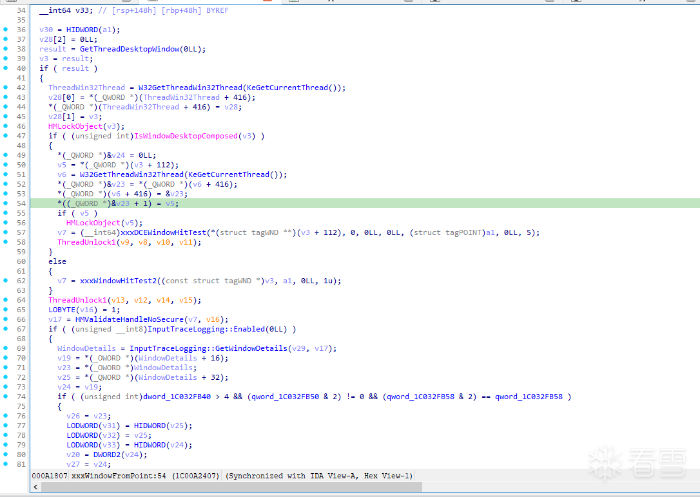
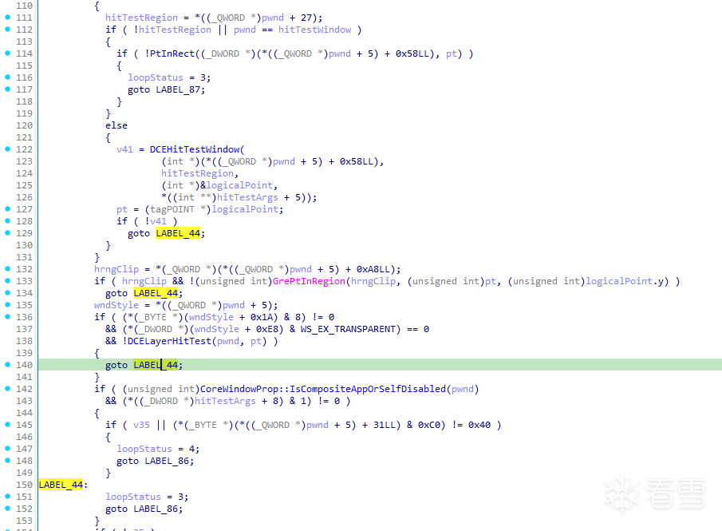
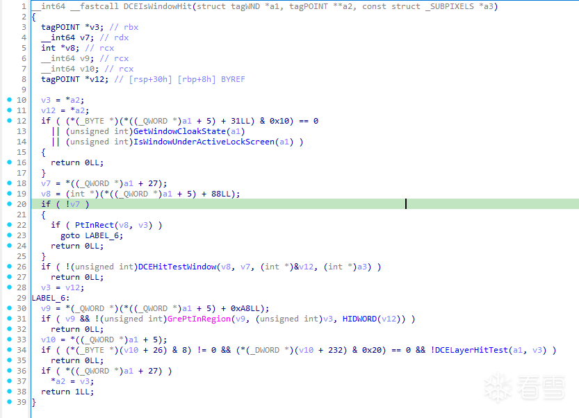
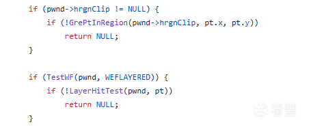
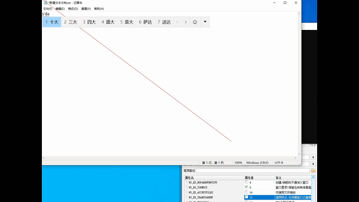

# 无WS_EX_TRANSPARENT实现Windows窗口鼠标穿透新姿势
交流学习QQ群: [700943852](https://qm.qq.com/q/ap8NyO37Ne)

## 1.前言
部分反作弊会通过检测窗口的扩展属性以及位置等其他信息来作为检测信息  
未公开属性属于个人分析以及现有能查询到资料猜想.如有不正确欢迎指正  
Windows系统版本:19045.5131
## 2.分析过程
提到WS_EX_TRANSPARENT,首先猜想可能的有关方向窗口消息以及鼠标

首先从消息入手  
根据查阅以往Win泄露源码得知消息事件底层是通过**xxxScanSysQueue**处理的,但win32k改动过大且大部分都未公开无符号信息,因此只能作为参考

打开IDA在win32kfull.sys中找到了**xxxScanSysQueue**  
翻阅伪代码查找到了一处疑似有关代码片段,根据其函数命名**WindowHitTest**感觉很有可能有关

 

进入**xxxDCEWindowHitTestIndirect_Iterative**函数  
函数定义
```cpp
HWND __fastcall xxxDCEWindowHitTestIndirect_Iterative(
        struct tagWND *a1,
        struct tagPOINT a2,
        char a3,
        struct tagDCE_WINDOW_HIT_TEST_ARGS *a4)
```
可以看到参数1是tagWND*类型,而参数2是一个POINT,返回值是一个HWND  
通过对函数伪代码分析,猜测是通过a1遍历所有窗口以及子窗口通过a2的位置进行测试,返回命中的窗口句柄  
通过对伪代码分析基本符合猜想,关键代码片段

 

这里可以看到如果不包含WS_EX_TRANSPARENT,且分层窗口未命中则跳转到循环尾部

而我们想要做到穿透需要做的是,当遍历到我们窗口时候让其跳过

美滋滋以为解决了  
打开Windbg设置条件断点并修改寄存器,让代码执行到LABEL_44

 

**发现没效果,白忙活**

回顾整体思路哪里出了问题呢  
突然想到Windows中提供了一个API **WindowFrompoint**作用是检测目标点对应窗口,当窗口设置**WS_EX_TRANSPARENT**扩展样式时候这个API同样无法探测到穿透窗口  
查看**xxxWindowFromPoint**代码



发现和**xxxScanSysQueue**有很多相同逻辑  
**xxxDCEWindowHitTest**是对**xxxDCEWindowHitTestIndirect_Iterative**的封装调用  
再次查看**xxxDCEWindowHitTestIndirect_Iterative**函数  

 

发现有三个地方会跳转到LABEL_44  
通过Windbg测试发现对**DCEHitTestWindow**进行修改可以实现穿透
## 3.思考
同样都是修改到LABEL_44分支为什么之前不可以呢,只能怀疑是不是有其他地方也有处理逻辑通过Windbg查看堆栈发现确实**DCEHitTestWindow**有其他地方调用  
xxxDCompSpeedHitTest->DCEIsWindowHit->DCEHitTestWindow,个人猜测应该是开头提到的鼠标

现在我们实现了穿透,但是通过内核Hook显然是不现实,我们需要一种不修改代码段的通用解决方案  
通过查看**DCEIsWindowHit**函数发现了一些相同点  

 

```cpp
  v9 = *(_QWORD *)(*((_QWORD *)a1 + 5) + 0xA8LL);
  if ( v9 && !(unsigned int)GrePtInRegion(v9, (unsigned int)v3, HIDWORD(v12)) )
    return 0LL;
```
查看旧版Win源码发现

 

hrgnClip似乎可以入手,只需要让hrgnClip不为0且GrePtInRegion判断返回false

通过Windbg修改这个对象为-1后发现同样实现了穿透且不需要Hook

## 4.代码实现
那么如何定位这个内存位置呢?  
众所周知窗口信息是内核层和用户层共享的通过user32.ValidateHwnd查看用户层返回地址得知返回的内存内容和内核中的是一个位置
```cpp
hrngClip = *(_QWORD *)(*((_QWORD *)a1 + 5) + 0xA8LL);
hrngClip = *(_QWORD *)(ValidateHwnd(hwnd) + 0xA8LL);
```
但用户层共享的内存是不可以修改的,我们需要使用MmMapIoSpace进行修改  
还有个问题点,我们不能保证这里的0xA8偏移是固定的  
解决方案通过GetRgnBox进行区域对比即可获得通用偏移值
```cpp
	std::uintptr_t find_hrgn_clip_pointer(HWND hwnd)
	{
		RECT window_rect{};
		GetWindowRect(hwnd, &window_rect);
		std::printf("rc %d %d %d %d\n", window_rect.left, window_rect.top, window_rect.right, window_rect.bottom);

		auto pwnd = validate_hwnd(hwnd);
		std::printf("pwnd:%llx\n", pwnd);

		for (size_t i = 0; i < 512; i++)
		{
			HRGN hrgn_clip = *reinterpret_cast<HRGN*>(pwnd + i);
			RECT clip_rc;
			if (!hrgn_clip || !GetRgnBox(hrgn_clip, &clip_rc))
				continue;
			std::printf("rgn %0x: %d %d %d %d\n", i, clip_rc.left, clip_rc.top, clip_rc.right, clip_rc.bottom);
			if (window_rect == clip_rc)
			{
				return pwnd + i;
			}
		}
		return -1;
	}
```
## 5.效果展示
 
## 6.附录
交流学习QQ群: [700943852](https://qm.qq.com/q/ap8NyO37Ne)
